# DS 總控台功能與設計檢視

日期：2026-10-05。範圍：03_Outputs/01_UI畫面設計/00_最新版/DS總控台畫面設計。

本次啟動最新版 Demo，巡覽所有側欄頁面、客戶詳情及官網產品詳情，檢查上傳入口與產品關閉確認，並對照原始需求、main.js、data.js 與實際載入的 app.bundle.js。未修改 Demo。這是前端流程與程式檢視，不代表真實後端、安全或正式部署驗收；未逐筆提交所有表單。巡覽期間瀏覽器未回報 error/warn。

## 整體判斷

視覺基礎可保留：配色一致、狀態有文字、產品與客戶入口清楚，產品總開關已有影響範圍及確認介面。但目前偏向資訊展示，尚不足以完整演示開通、續約、例外權限、版型發布與回復等主要工作。

不將「沒有真實登入、沒有 API、沒有真實寄信或部署」判成缺漏，因為原始需求明確允許模擬。真正的問題是許多操作連前端資料及紀錄也沒有更新。

目前導覽刻意整併功能管理、版型管理及客戶分類，操作說明也描述了這個方向，因此不直接要求恢復原始側欄。應補足整併後的工作入口與流程。

## 優先補足的功能與邏輯

| 優先 | 問題及證據 | 影響與建議 |
|---|---|---|
| P1 | 客戶只有一份 expiresAt、status、quota，兩個產品共用；步驟 2、main.js:283 | 無法表示 E2B 有效、官網到期。建立每間公司 × 每項產品的獨立使用權，含起訖、開通、付款、寬限期、續約、暫停與終止。 |
| P1 | 最終權限判斷只看部分客戶狀態與 feature.enabled；試用用功能排列前兩項判斷；main.js:333–344 | 沒有納入產品總開關、發布對象、實際期限、例外權限及額度。建立共用判斷並列出阻擋原因；禁止靠排序決定試用權限。 |
| P1 | 客戶功能開關只呼叫提示；步驟 2、main.js:313 | 外觀可點但不會變更客戶權限。補系統預設／額外開啟／強制關閉，以及原因、生效和結束時間。 |
| P1 | 品牌樣式上傳實測只出現「任務已建立」提示；步驟 4、main.js:396 | 缺選檔、進度、檔案結構、定義、檢查明細、桌機手機預覽與指定測試客戶。即使模擬，也應走完整狀態。 |
| P1 | 版型只有單一 version 字串；步驟 4、data.js 的 templates | 缺不可覆寫的歷史版本、正式／測試版本、客戶綁定版本、差異、回復及下架三種處置。直接編輯版本號不等於版本管理。 |
| P1 | 發布、額度調整、通知建立與草稿按鈕只提示成功；步驟 5–7 | 必須新增或更新前端資料，並能重新查到結果。提示要區分模擬成功、未執行與失敗。 |
| P1 | 新增客戶預設沒有 products，列表會直接呼叫 products.includes；main.js:211、571 | 靜態程式檢視顯示存在新增後渲染例外風險，尚未以 UI 提交重現。補齊預設值、必填及型別驗證。 |
| P1 | 新增功能未帶所屬產品，表單也沒有產品欄位；main.js:503、571 | 從產品詳情新增功能後可能不出現在該產品清單。應自動綁定目前產品，並顯示關聯。 |
| P1 | 編輯抽屜可直接修改 enabled，儲存不走關閉確認；main.js:503、558 | 可繞過原因與影響確認；需統一敏感操作入口。確認框的恢復時間與通知選項也沒有被 confirmModal 保存。 |
| P1 | 延長期限直接指定 2026-11-30、109 天並改成使用中；main.js:582 | 未選產品、未填原因，對原本更晚到期者甚至可能縮短期限，並改寫停權狀態。改成選產品、日期及原因，顯示變更前後。 |
| P2 | 操作紀錄只有時間、人、文字、對象；步驟 8 | 補模組、類型、原因、前後值及詳情；以實際模擬時鐘記錄，不固定同一時間。 |
| P2 | 通知沒有訊息清單與收件人明細；步驟 7 | 補預覽、草稿、排程、取消、發送結果與失敗處理；「受影響客戶」應能展開明細。 |
| P2 | 額度只有百分比；步驟 6 | 補產品、額度類型、單位、已用／總量、重置週期、不限量、臨時額度與到期；100% 不應標「即將到期」。 |
| P2 | 帳號以四個模組勾選管理；步驟 9 | 無法清楚區分檢視、編輯、發布、停權、匯出與核准。是否採角色模板可討論，但至少需動作與資料範圍。 |
| P2 | 客戶詳情只有基本資訊、流程、產品、功能；步驟 2 | 缺公司使用者、聯繫備註、客戶專屬操作紀錄、官網版本套用／更換等入口。 |

## 設計與一致性

1. **客戶與全域管理範圍混淆。** 客戶產品列的「管理產品」導向全公司的產品詳情。建議主要按鈕改為「管理此客戶使用權」，全域產品另放次要連結。
2. **全頁共用「新增」不符合語境。** 發布、通知、額度、紀錄與系統設定頁皆有新增，程式預設會開新增產品。改為明確的「建立發布」「建立通知」；不適合新增的頁面取消入口。
3. **待處理佇列尚未形成工作流程。** 「處理」只顯示提示，「查看全部」由共用 panel 固定導向產品列表。應連到相對應事件、客戶與處理表單，並能完成／指派／追蹤。
4. **待辦類型、嚴重程度與狀態混在一起。** 目前高優先一律標「維護中」，其餘標「即將到期」，因此付款逾期也叫維護中。三個欄位應分開。
5. **狀態互相推算造成誤解。** 停權被推成付款逾期，到期也被推成付款逾期；已付款仍可能到期，停權也可能因其他原因。付款、使用權及維護應獨立。
6. **資料口徑不一致。** 客戶 8 間，但產品顯示 128／86 間、使用中權限 214；E2B 顯示 7 個功能、詳情只有 4 個。即使使用摘要樣本也需標明，最好用同一份資料計算。
7. **日期失真。** 2026-10-05 檢視時，2026-08-29 仍顯示剩 16 天。可明示「情境基準日 2026-08-13」，或由統一 Demo 時鐘計算；不要同時保存日期與手寫剩餘天數。
8. **資訊密度分配。** 1440px 桌面產品表仍把負責人折行，右側編輯需水平捲動。建議保留重要欄位、描述放摘要／詳情、操作欄固定。發布頁左側窄表也隱藏了部分欄位。
9. **官網詳情過長。** 功能、客戶、發布、品牌樣式、內容版型、紀錄垂直堆疊；可保留現有資訊架構，增加頁籤或段落導覽與各區新增入口。
10. **搜尋與篩選不一致。** 搜尋外觀像全域搜尋，實際僅部分列表使用 query；其他頁沒有作用。缺排序、分頁、完整空結果提示，產品與狀態也不能清楚交叉篩選。
11. **查看與編輯未分工。** 功能／版型的查看和編輯開同一編輯抽屜；狀態、版本、檢查結果多為自由輸入，沒有狀態流轉或檢查的約束。
12. **表單草稿可能遺失。** showToast 會重建整個頁面且 2.2 秒後再重建；未存入 state 的輸入可能消失。需把表單草稿獨立保存，驗證失敗保留輸入。
13. **窄版導覽佔滿第一屏。** 步驟 1 的窄視窗需先捲過全部導覽才到內容，可改收合導覽。此項低於桌面核心流程優先度。
14. **可及性待改善。** 多個開關同名「總開關」，沒有可辨識的項目名稱與 checked 語意；關閉鈕僅 ×；確認彈窗缺 dialog/aria-modal 等語意。需另外測鍵盤焦點、Escape、螢幕閱讀器和對比，不能由截圖宣稱合規。

## 需要先討論的決策

| 議題 | 必須決定的問題 | 建議起點 |
|---|---|---|
| 產品、方案與版型 | 目前是否真的存在收費方案？畫面的「企業標準方案」是否獲確認？官網方案欄位目前直接放版型名稱是否合理？ | 先維持 E2B／官網兩個產品，方案與版型分開；未確認的方案名稱不要當已定規格。 |
| 官網資產架構 | 已由整站 HTML 版型拆為品牌樣式與內容區塊，是否確定？能否任意搭配？ | 若確定拆分，定義品牌樣式版本、內容版型版本、頁面組成與相容性，避免只改名稱。 |
| 最終權限優先序 | 額外開啟能否越過產品維護、到期、未發布、額度不足？ | 全域停用與使用权失效先阻擋；例外只改明確允許的功能範圍。需要業務方確認。 |
| 到期與付款 | 到期停哪些功能？有無寬限期？付款逾期是否自動停權？續約从原到期日或付款日計算？ | 付款與授權各自存狀態；將自動處置與人工處置列成表。 |
| 官網停用範圍 | 關閉官網產品時，是不能編輯發布，還是公開網站也下線？表單與網域如何處理？ | 明列訪客網站、客戶後台、發布、表單四個範圍；避免總開關含義不明。 |
| 版本更新 | 新版發布是否自動影響全部既有網站？可以固定舊版嗎？ | 客戶綁定版本，預設明確選批次升級；需要預覽差異與回復。 |
| 更換版型 | 保留哪些內容？不相容欄位怎麼辦？誰確認受影響頁面？ | 提供套用前差異與內容映射結果、快照及回復方式。 |
| 試用與測試 | 試用可用哪些功能、多久、多大額度？指定測試客戶是否要有效使用權？ | 明確配置功能集合，不能依陣列前兩項。 |
| 人員權限 | 按職員直接授權，或角色預設加個別例外？誰可發布、全域停用與匯出？ | 列動作矩陣，視高影響操作需求再決定是否双人核准。 |
| 額度 | 依公司、產品、功能或網站計算？超量立即停用還是允許超額？ | 先確定計量單位、週期、重置與超量處置，再設計調整介面。 |
| 公司與網站 | 一家公司能有幾個網站、品牌、網域與客戶端使用者？ | 若不是一對一，需在公司與版型中加入網站實體。屬新增設計決策，不是已確認需求。 |

## 建議安排

第一輪先定「獨立產品使用權、權限優先序、官網資產與版本模型」；第二輪完成三條可演示流程：客戶開通到續約、版型上傳到發布回復、停用到通知與紀錄；第三輪整理表格、導覽、搜尋及空錯誤狀態。不要先增加更多頁面或重新換視覺風格。

## 本次逐步畫面與健康度

### 1. 儀表板（窄視窗）：待改善
資料口徑、到期日期與待辦狀態不一致；導覽過長。原始截圖保留窄視窗，後續桌面頁採 1440 × 1000 檢視。

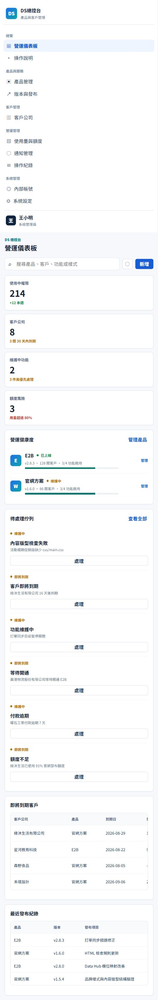

### 2. 客戶詳情：核心邏輯待補
獨立使用權、特殊權限、官網套用等流程缺失；全域與單一客戶範圍需區分。

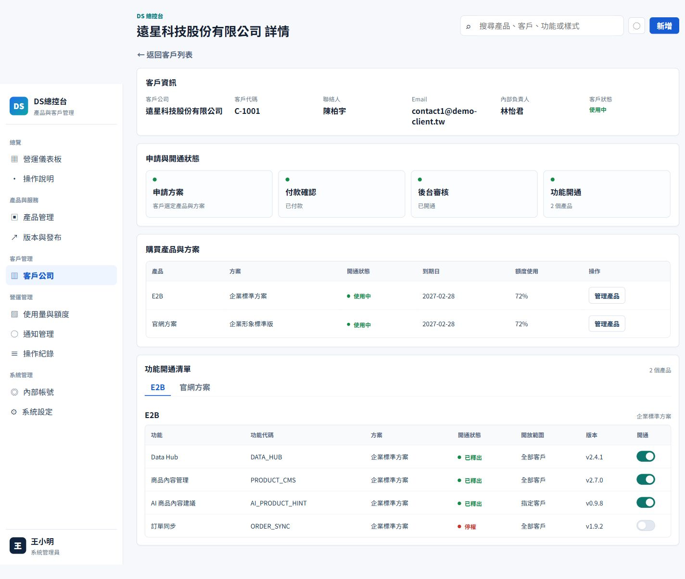

### 3. 產品列表：部分可用
總開關有確認入口；表格擁擠與彙總數量不一致。

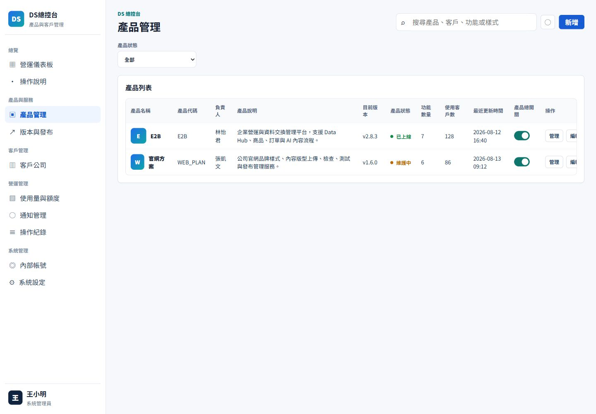

### 4. 官網產品、功能、品牌樣式與內容版型：主要流程待補
已有分類，缺上傳到檢查、預覽、測試、發布、回復與下架的完整演示。

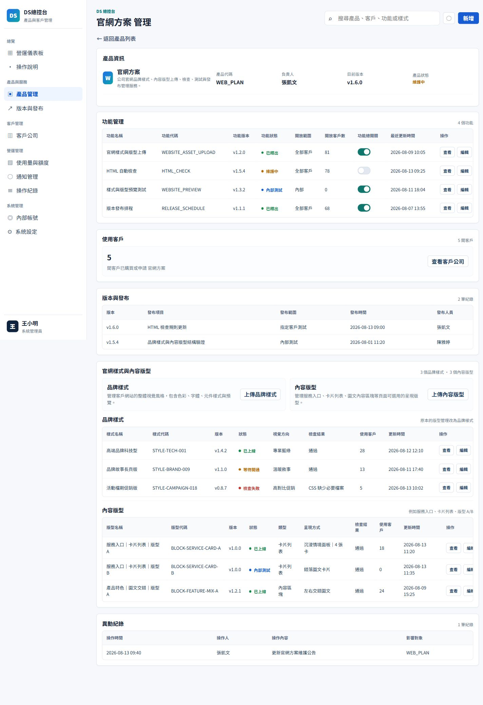

### 5. 版本與發布：展示為主
有清單與檢查項目，但未形成發布任務及狀態管理。

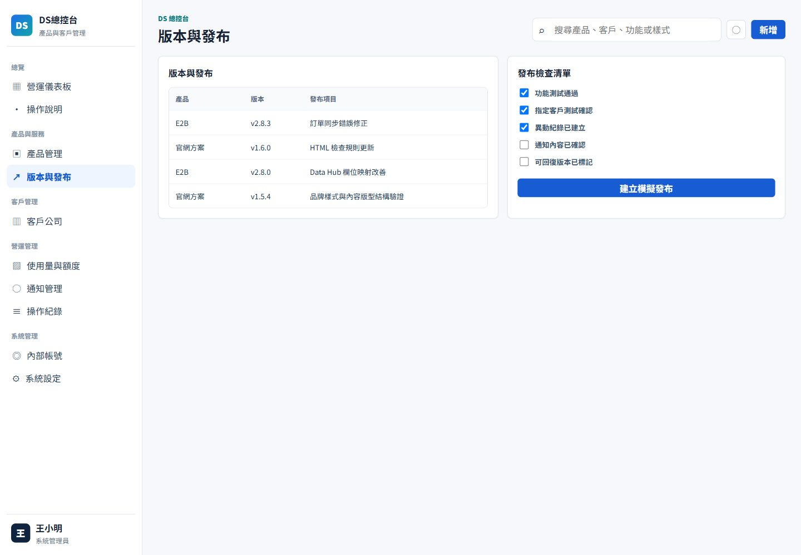

### 6. 使用量與額度：待補
有視覺進度，缺數值、單位、週期及有效調整。

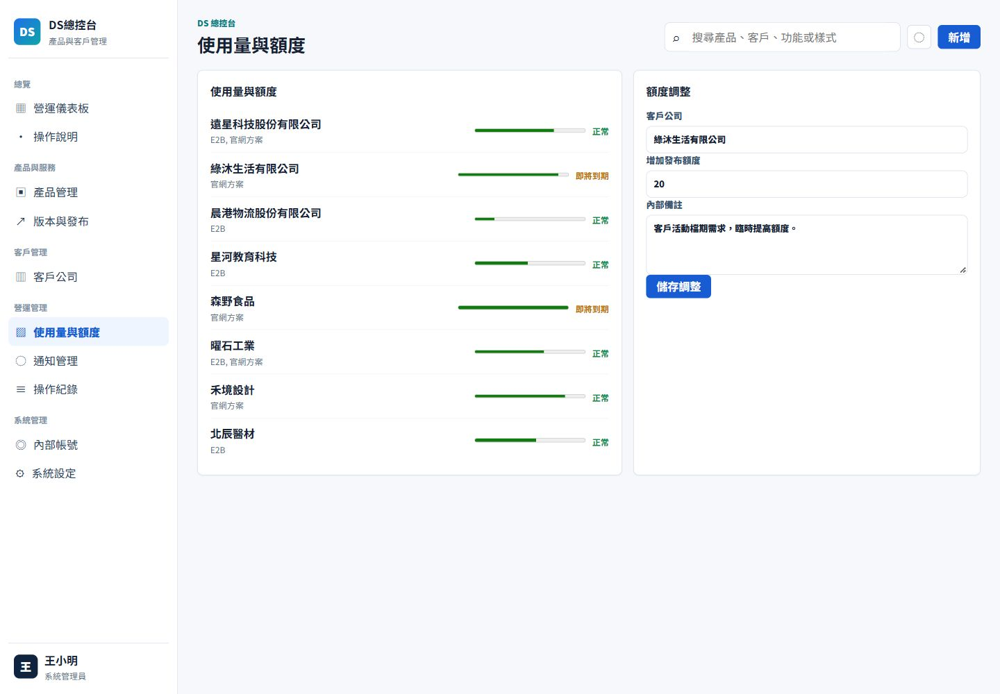

### 7. 通知管理：待補
有編輯外觀，缺收件人選擇、通知清單、排程及結果。

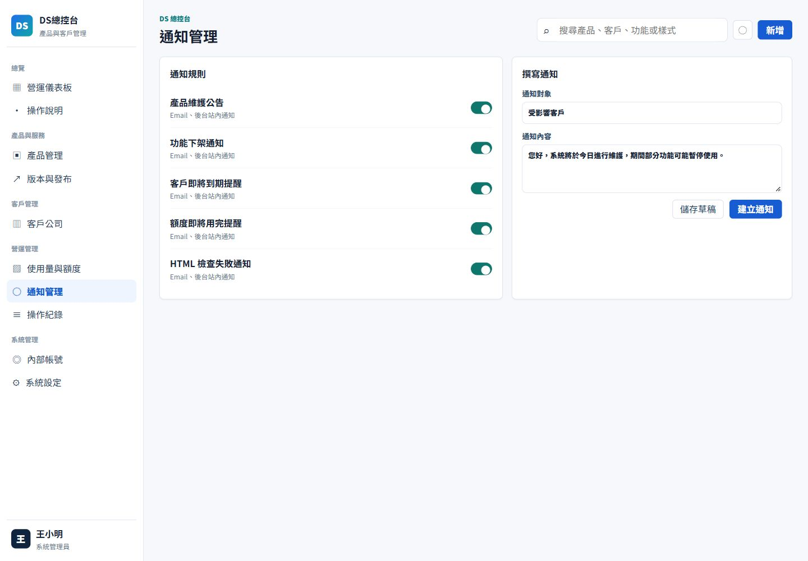

### 8. 操作紀錄：部分可用
有基本紀錄，但缺前後差異、原因、篩選與詳情。

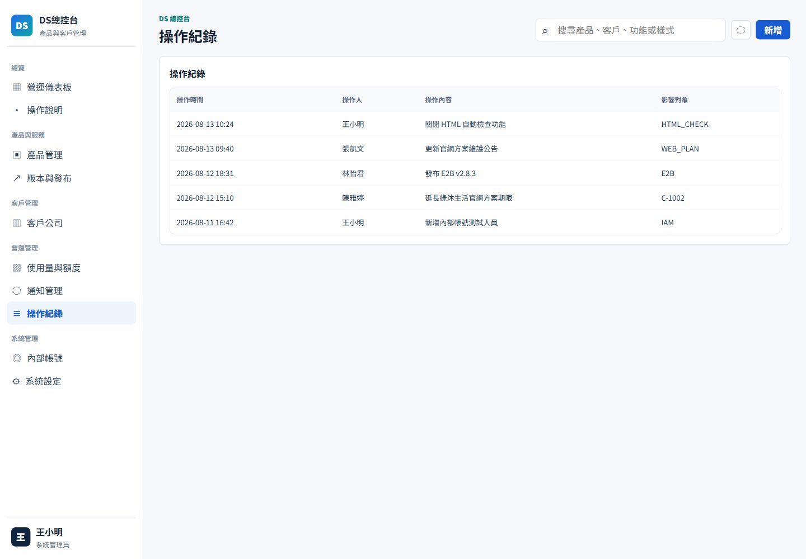

### 9. 內部帳號：部分可用
已有編輯與模組權限結構，動作權限及邀請狀態仍需補。

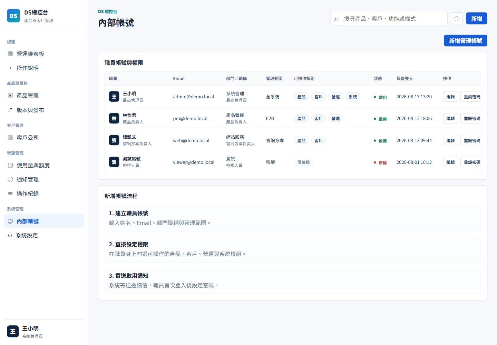

### 10. 系統設定：展示為主
設定顯示已啟用，但操作只提示；Demo 應明示模擬狀態。

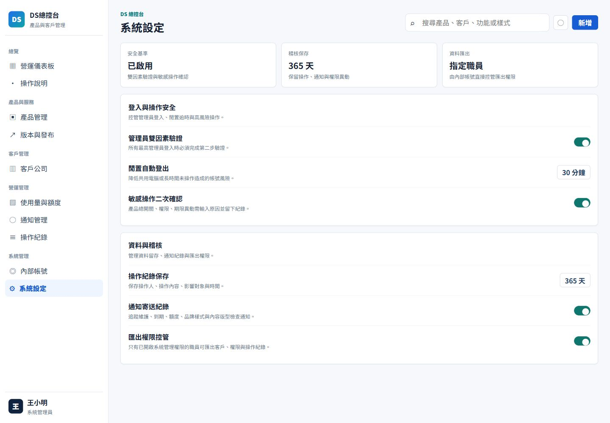

### 11. 操作說明：可作導覽
反映目前整併方向，但文字描述的完整工作流程尚未實現。

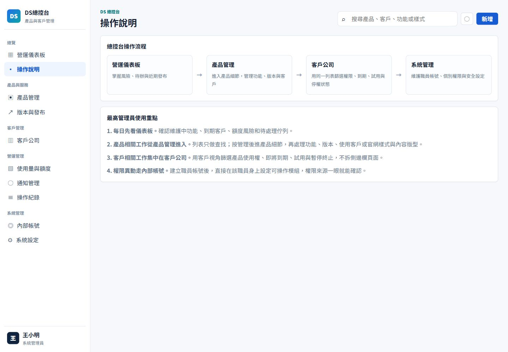

### 12. 產品關閉確認：基礎良好、資料連動待補
有影響數、原因、通知與二次確認。影響數未由關聯資料推導，恢復時間／通知沒有保存。此次僅開啟並取消，未執行關閉。

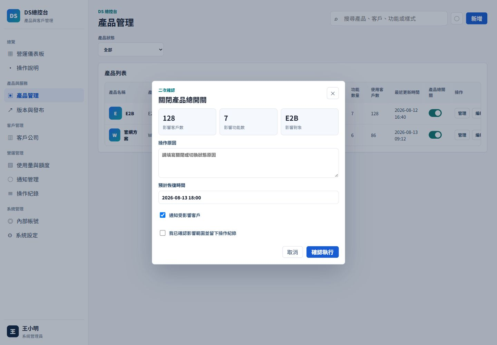
